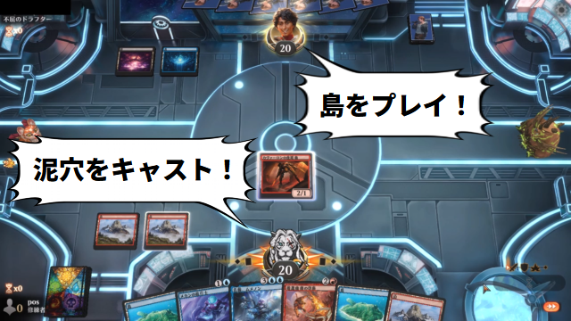

# MayhemFamiliar

これは何？
---------
MTG Arenaの対戦内容を実況してくれます。 
音声合成エンジンとして「Microsoft Speech API（SAPI）」「VOICEVOX」「AssistantSeika」に対応しています。 

ダウンロード
------
下記リンクのAssetsからMayhemFamiliar.zipをダウンロードしてください。 
https://github.com/poslogithub/MayhemFamiliar/releases/latest 
zipファイルを展開すれば、そのまま使えます。 

使い方
------
- MTGアリーナを起動
- （初回のみ）MTGアリーナの「詳細ログ」を有効化（設定 > アカウント > 詳細ログにチェックを入れてMTG Arenaを再起動）
- 音声合成製品を起動
  - AssistantSeikaの場合、MayhemFamiliar.exeと同じフォルダに「SeikaSay2.exe」を配置してください。
- MayhemFamiliar.exeを実行
- 「話者」タブで音声合成エンジンと話者を選択

動作環境
--------
- Windows 10以上
- またはWindows 7以上、かつ.NET Framework 4.6以上

ライセンス
----------
LICENSE ファイルを参照してください。

お問い合わせ先
-------------
X（旧Twitter）: https://x.com/poslog

MayhemFamiliarはファンコンテンツ・ポリシーに沿った非公式のファンコンテンツです。 
ウィザーズ社の認可/許諾は得ていません。 
題材の一部に、ウィザーズ・オブ・ザ・コースト社の財産を含んでいます。 
©Wizards of the Coast LLC. 
